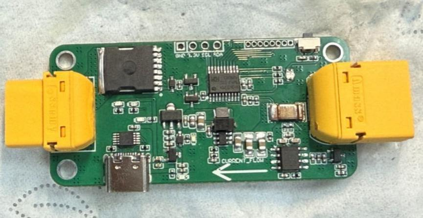

# 基于 CH32V003 与 NRF24L01 的大功率电子开关及遥控器

## 项目背景

本项目是一套由“大功率电子开关”和“手持遥控器”组成的无线通断控制系统。它面向机器人、无人机、航模、电池供电设备和高功率负载测试场景，解决一个很实际的问题：设备功率越来越大之后，手动插拔电池或靠近设备开关并不总是安全、方便，也不利于记录电流、电压、功率等状态。

电子开关端负责承受高电压和大电流，完成电流检测、功率显示、无线回传和远程通断；遥控器端负责发送控制指令、显示回传状态，并通过两节 18650 电池和 PD 快充方案实现便携使用。换句话说，这不是一个孤立的开关板，而是一套“远程控制 + 状态监测 + 人机交互”的小系统。

这个项目很适合体现工程中的“人用起来顺不顺手”。很多硬件项目只关注电路能不能通，但真正上设备时，还会遇到看不见电流、不知道是否上电成功、短路时来不及断开、测试人员必须靠近高功率设备等问题。本项目把 OLED 显示、NRF24L01 无线链路、检流芯片和大功率 MOSFET 组合起来，就是为了让通断控制更可控、更直观，也更适合真实调试环境。

当前目录包含立创 EDA 专业版硬件工程文件：

- ProPrj_远程检流开关_2026-08-23.epro2

## 设计目标

本项目的核心目标是“远程、安全、可观察”。电子开关不只是一个大 MOSFET，它还需要知道当前电压是多少、电流是多少、功率是多少，最好还能把这些信息显示出来或回传给手持端。遥控器也不只是发一个开关信号，它需要有自己的供电、充电、显示和无线通信能力。

设计时主要关注以下目标：

- 支持 12-50V 宽电压输入，覆盖多种电池和高功率负载场景。
- 支持大电流测量，便于观察负载工作状态。
- 通过 NRF24L01 实现无线遥控和状态回传。
- 通过 OLED 显示电流、电压、功率，让现场调试更直观。
- 使用 Type-C 和 CH340E 提供调试与通信便利性。
- 遥控器采用两节 18650 电池供电，并支持 PD 快充，提高便携性。
- 预留短路保护、上电缓启动等扩展功能空间。

## 功能特性

- 电子开关支持 12-50V 宽电压输入。
- 电子开关主控采用 CH32V003F4P6。
- 板载 INA826 检流芯片，用于电流检测。
- 板载 NRF24L01 射频方案，用于无线遥控与状态回传。
- 板载 CH340E、Type-C 和 OLED，可显示电流、电压、功率。
- 使用 NCEP023N10LL、A3400 等 MOSFET 与栅极驱动方案。
- 最大支持约 130A 电流测量范围。
- 可扩展短路自动保护、上电缓启动等功能。
- 遥控器主控同样采用 CH32V003F4P6，便于固件统一维护。
- 遥控器采用 NRF24L01 与电子开关通信。
- 遥控器支持两节 18650 电池供电，最大约 20Wh 容量。
- 遥控器支持 PD 快充，理论最大 24W 充电功率。
- 遥控器可通过 OLED 显示电子开关回传的电流、电压、功率等信息。

## 硬件构成

电子开关端主要由输入电源、功率开关、检流、主控、无线通信、显示和调试接口组成。输入端接收 12-50V 电源，功率 MOSFET 负责高功率负载的通断，INA826 负责电流检测，CH32V003F4P6 负责采样、控制和通信，NRF24L01 负责无线链路，OLED 负责本地状态显示，CH340E 与 Type-C 负责调试和串口连接。

遥控器端则更像一个小型手持终端。它有自己的电池系统、PD 快充芯片、稳压电路、主控、无线通信模块和 OLED。两节 18650 电池让它可以脱离外部电源使用，PD 快充则让充电体验更接近日常电子设备，而不是临时接一堆线充电。

这套设计的一个特点是“近端和远端都能看见状态”。电子开关本体可以显示电流、电压、功率，遥控器也能接收回传信息。对于高功率设备测试来说，这种反馈非常有价值，因为操作者不必一直靠近负载，也能判断系统是否处在正常工作区间。

## 安装与打开工程

1. 安装立创 EDA 专业版。
2. 克隆或下载本项目仓库。
3. 使用立创 EDA 专业版打开 ProPrj_远程检流开关_2026-08-23.epro2。
4. 检查电子开关功率回路、检流回路、NRF24L01 射频接口、OLED 接口和 Type-C 调试接口。
5. 检查遥控器相关电源、充电、显示和无线通信电路。
6. 根据加工需求导出 Gerber、BOM 和贴片坐标文件。
7. 若需要调试固件，请准备 CH32V003 开发环境、WCH-Link、NRF24L01 模块、限流电源和合适的测试负载。

## 使用示例

建议先分别验证电子开关和遥控器，再进行联调。电子开关端先在限流电源下验证 12V、5V、3.3V 等电源轨，确认主控、OLED、NRF24L01 和检流电路上电正常。遥控器端先验证电池供电、PD 充电、OLED 显示和无线模块工作情况。两个端都能单独运行后，再烧录配套固件并进行 NRF24L01 配对。

联调时，可以先接小负载，例如灯泡、电阻负载或低功率模块，通过遥控器发送开关指令，观察电子开关是否执行通断，同时查看两端 OLED 的电流、电压、功率显示是否一致。确认逻辑正常后，再逐步提高负载功率。在大功率测试中，建议记录输入电压、负载电流、MOSFET 温度、开关响应时间和无线回传稳定性。

如果用于机器人或无人机整机，可以把电子开关放在主电源输入处，把遥控器作为上电和断电工具。这样调试时不必反复插拔高电流接头，也可以在异常情况下更快切断电源。当然，高功率系统始终需要机械保险、急停和限流措施，电子开关不应被当作唯一安全手段。

## 技术架构

- 开关控制层：CH32V003F4P6 负责通断控制、采样处理、显示刷新和无线通信调度。
- 功率层：NCEP023N10LL、A3400 等 MOSFET 与栅驱电路负责高功率负载通断。
- 检测层：INA826 检流芯片负责电流检测，配合电压采样计算功率。
- 通信层：NRF24L01 实现电子开关与手持端之间的无线控制和数据回传。
- 显示与调试层：OLED 显示运行状态，CH340E 与 Type-C 提供调试和串口通信能力。
- 遥控器供电层：CH221K PD 快充芯片、SY6912、AMS1117 3.3V 等器件组成便携供电系统。
- 应用层：面向远程上电、远程断电、负载监测、测试台控制和高功率设备调试。

## 测试与安全说明

项目资料中已经给出：电子开关支持 12-50V 宽电压输入，最大 130A 电流测量范围，可通过 OLED 显示电流、电压、功率，也可远程回报给手持端；配置 100V、300A 等级的大功率 MOSFET 后，可实现远程遥控通断。后续建议补充不同负载下的电流显示精度、无线通信距离、MOSFET 温升、长时间运行稳定性和异常断电测试。

由于本项目涉及高电压和大电流，复现时必须使用限流电源、合适线径、保险措施和绝缘保护。首次上电不要直接连接高功率负载，先确认逻辑供电和控制链路没有问题。进行大电流测试时，建议拆除不必要的机械运动部件，并保持人员与负载的安全距离。

## 项目照片

本仓库已补充 `photo/` 目录，用于展示大功率电子开关与遥控器装置实物。完整照片说明见 `docs/PHOTOS.md`。

## 开源说明

本仓库开放硬件工程文件、项目文档和实物照片，方便其他人查看电源、功率开关、电流采样、无线通信和手持遥控器的整体设计。后续建议继续补充系统连接图、测试视频、通信协议说明，以及电子开关端与遥控器端的固件说明。

## 后续计划

- 补充电子开关端和遥控器端的系统框图。
- 补充 NRF24L01 通信协议说明，例如配对、控制帧、回传帧和丢包处理。
- 补充 OLED 显示页面说明。
- 补充短路保护、缓启动和异常断电策略的固件设计文档。
- 补充不同负载下的测试表格和温升记录。

## License

This hardware design is released under CERN Open Hardware Licence Version 2 - Permissive (CERN-OHL-P-2.0). See LICENSE. If firmware is added later, place a separate software license in the firmware directory.
